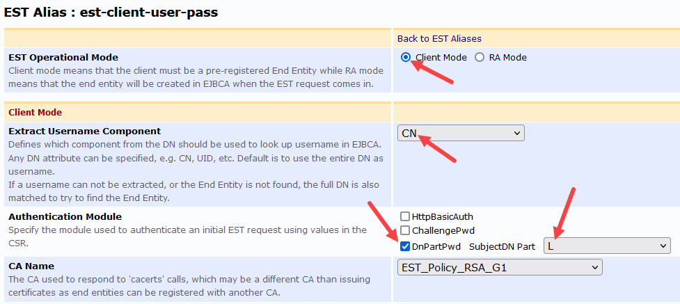
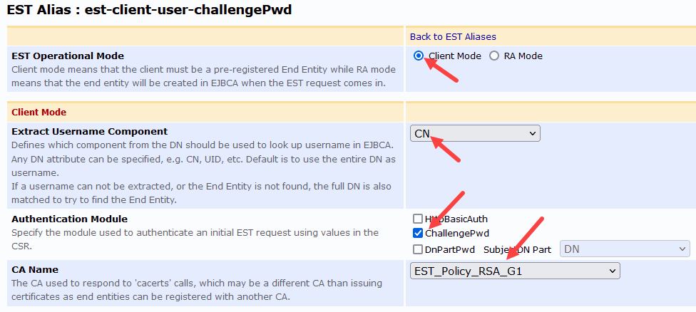
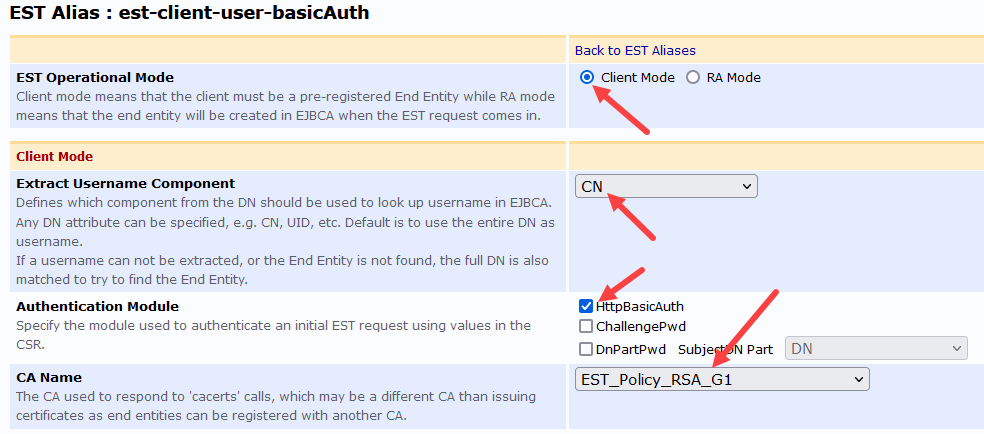
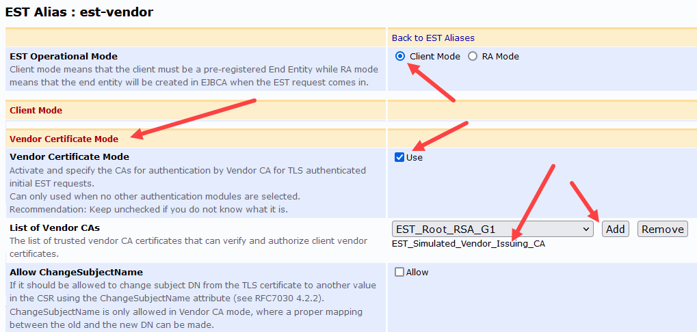
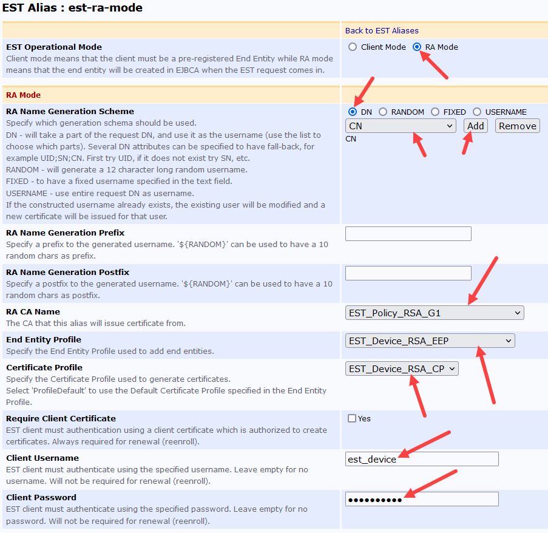

# EST Client
The EST Client is a completely self-contained EST client example application.  This supports automatic enrollment in EJBCA Client Mode, as well as EJBCA in RA Mode.  As the application target is IoT devices requiring On Device Key Generation (the safest mode), not all EST specific functions are implemented.

## Compatibility
**EJBCA-EE v6.11 or greater.**  
**EJBCA-CE does not implement the EST protocol.**

## Platform Specific Notes
| EST Endpoint             | EJBCA-EE | EJBCA-CE |
|:-------------------------|:--------:|:--------:|
| Supports /cacerts        | &check;  |    -     | 
| Supports /simpleenroll   | &check;  |    -     |
| Supports /simplereenroll | &check;  |    -     |
| Supports /fullcmc        |    -     |    -     |
| Supports /serverkeygen   |    -     |    -     |
| Supports /csrattrs       |    -     |    -     |

| Alias Mode |    Username     |   Authentication    | Client                                                  |
|:-------------------|:---------------:|:-------------------:|:--------------------------------------------------------|
| Client Mode        | Extract from DN |   Extract from DN   | Use subject switch                                      |
| Client Mode        | Extract from DN |   Extract from DN   | Use eeuser, eekey, eepass switches                      |
| Client Mode        | Extract from DN | challengePwd in CSR | Use eeuser and challengepass switches                   |
| Client Mode        | Extract from DN | challengePwd in CSR | Use eeuser and subject swtiches                         |
| Client Mode        | Extract from DN | Basic Auth HTTPS | Use username, password, and eeuser switches             |
| Client Mode        | Extract from DN | Basic Auth HTTPS | Use username, password, and subject switches            |
| Client Mode        | Extract from DN | Vendor Certificate Auth not allowing name change | Use subject, birthcert, birthkey, birthkeypass switches |
| RA Mode | Extract from DN | Basic Auth HTTPS PSK | Use username, password, and subject switches            |


## For new devices, the client:
1. Grabs the EST Aliases certificate chain from /cacerts
2. Converts the PKCS7 chain into an x.509 PEM file & saves to the file system.
3. Creates a new keypair (Kpriv and Kpub)
4. Creates a CSR for EJBCA running in Client Mode (enrollmentcode or vendor mode)
5. Submits the CSR to EJBCA
6. Converts the PKCS7 file into an x.509 PEM file & saves to the file system.
7. Saves Kpriv to the file system.

## For re-enrollment, the client:
1. Creates a new keypair (Kpriv and Kpub)
2. Creates a CSR for submittal to the EST Alias endpoint
3. Uses mTLS with the existing certificate to submit the new CSR to EJBCA
4. Converts the returned PKCS7 file into an x.509 PEM file & saves that to the file system [backing up the old cert].
5. Save the new Kpriv to the file system [backing up the old key].


# Building the client
## Debian based (e.g., Poky, Ubuntu, Raspian, Raspberry Pi OS, etc.)
	sudo apt update
	sudo apt install -y build-essential git libcurl4-gnutls-dev curl libssl-dev
    cd ~
    git clone https://github.com/Keyfactor/keyfactor-c-estclient.git
    cd keyfactor-c-estclient
    make

## RHEL based (RHEL, CentOS, Rocky, etc.)
	sudo dnf update -y
	sudo dnf groupinstall -y "Development Tools"
	sudo dnf install -y curl-devel curl openssl-devel
    cd ~
    git clone https://github.com/Keyfactor/keyfactor-c-estclient.git
    cd keyfactor-c-estclient
    make

# Example client re-enrollment calls
What follows is an example of a re-enrollment call.  In EST, the last issued certificate is used to authenticate the client before issuing a new Certificate.  After this example, we see how to set up EJBCA for different initial enrollment types.
### Client Call Example
```commandline
./keyfactor-c-estclient \
--trust certs/trust.store --url https://ejbca-est-v8.keyfactoriot.com --alias est-ra-mode \
--clientcert certs/client.pem --clientkey certs/client.key.pem --clientpass shhh \
--keytype RSA --keysize 2048 \
--subject "CN=EST_Device_RA_1,OU=IoT Strategy,O=Keyfactor" \
--username est_device --password est_password \
--reenroll
```

# Setting up EJBCA & Example client enrollment calls
## Client Mode - Extract both username and password from the subject DN


### Client Call Example   
Implicitly set username:enrollmentcode in subject
```commandline
./keyfactor-c-estclient \
--trust certs/trust.store --url https://ejbca-est-v8.keyfactoriot.com --alias est-client-user-pass \
--clientcert certs/client.pem --clientkey certs/client.key.pem --clientpass shhh \
--cacert certs/cacert.pem --keytype RSA --keysize 2048 \
--subject "CN=EST_Device_1,L=password"
```
### Client Call Example   
Have the client construct the subject and set username:enrollmentcode in subject
```commandline
./keyfactor-c-estclient \
--trust certs/trust.store --url https://ejbca-est-v8.keyfactoriot.com --alias est-client-user-pass \
--clientcert certs/client.pem --clientkey certs/client.key.pem --clientpass shhh \
--cacert certs/cacert.pem --keytype RSA --keysize 2048 \
--eeuser "EST_Device_1" --eekey "L" --eepass password
```
## Client Mode - Extract username from subject DN and use challengePwd on the CSR


### Client Call Example
Have the client use the challengePwd part of the CSR for the enrollmentcode and extract the username from the CN, supplying the username via eeuser
```commandline
./keyfactor-c-estclient \
--trust certs/trust.store --url https://ejbca-est-v8.keyfactoriot.com --alias est-client-user-challengePwd \
--clientcert certs/client.pem --clientkey certs/client.key.pem --clientpass shhh \
--cacert certs/cacert.pem --keytype RSA --keysize 2048 \
--eeuser "EST_Device_1" --challengepass password
```

### Client Call Example
Have the client use the challengePwd part of the CSR for the enrollmentcode and extract the username from the CN, supplying the username via subject
```commandline
./keyfactor-c-estclient \
--trust certs/trust.store --url https://ejbca-est-v8.keyfactoriot.com --alias est-client-user-challengePwd \
--clientcert certs/client.pem --clientkey certs/client.key.pem --clientpass shhh \
--cacert certs/cacert.pem --keytype RSA --keysize 2048 \
--subject "CN=EST_Device_1" --challengepass password
```

## Client Mode - Extract username from subject DN and use HTTPS Basic Authentication


### Client Call Example
Have the client use basic authentication for the password and extract the username from the CN, supplying the username via eeuser
```commandline
./keyfactor-c-estclient \
--trust certs/trust.store --url https://ejbca-est-v8.keyfactoriot.com --alias est-client-user-basicAuth \
--clientcert certs/client.pem --clientkey certs/client.key.pem --clientpass shhh \
--cacert certs/cacert.pem --keytype RSA --keysize 2048 \
--eeuser "EST_Device_1" --username EST_Device_1 --password password
```

### Client Call Example
Have the client use basic authentication for the password and extract the username from the CN, supplying the username via subject
```commandline
./keyfactor-c-estclient \
--trust certs/trust.store --url https://ejbca-est-v8.keyfactoriot.com --alias est-client-user-basicAuth \
--clientcert certs/client.pem --clientkey certs/client.key.pem --clientpass shhh \
--cacert certs/cacert.pem --keytype RSA --keysize 2048 \
--subject "CN=EST_Device_1" --username EST_Device_1 --password password
```

## Client Mode - Extract Username Component from CN, Vendor Certificate Auth, Birth Cert has same DN as End Entity

#### NOTE: The CA that issues the certificate is defined in the End Entity Profile for the user, not here.
### *NOTE: The DN MUST be in the same ORDER as that defined in the End Entity Profile*

### Client Call Example
```commandline
./keyfactor-c-estclient \
--trust certs/trust.store --url https://ejbca-est-v8.keyfactoriot.com --alias est-vendor \
--clientcert certs/client.pem --clientkey certs/client.key.pem --clientpass shhh \
--cacert certs/cacert.pem --keytype RSA --keysize 2048 \
--subject "CN=EST_Device_1,OU=IoT Strategy,O=Keyfactor" --birthcert certs/birth-cert.pem --birthkey certs/birth-key.pem
```

## RA Mode - Extract Username from DN, HTTPS Basic Auth supplies the Pre-shared Username/Key
 
### Client Call Example
```commandline
./keyfactor-c-estclient \
--trust certs/trust.store --url https://ejbca-est-v8.keyfactoriot.com --alias est-ra-mode \
--clientcert certs/client.pem --clientkey certs/client.key.pem --clientpass shhh \
--cacert certs/cacert.pem --keytype RSA --keysize 2048 \
--subject "CN=EST_Device_RA_1,OU=IoT Strategy,O=Keyfactor" \
--username est_device --password est_password
```